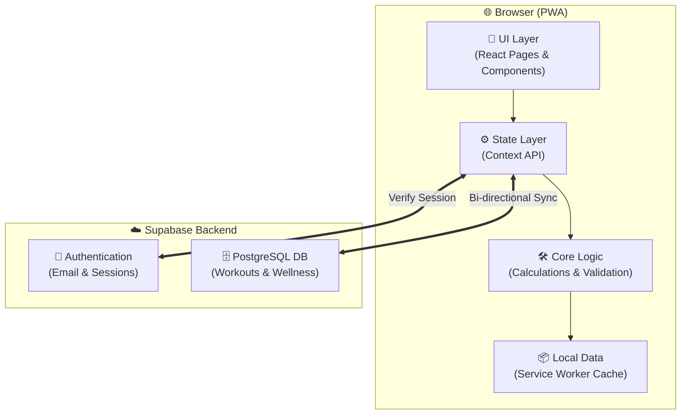

# 💪 FitTrack — Personal Workout Tracker (PWA)

**FitTrack** is a personal, offline-first **Progressive Web App (PWA)** built to explore modern frontend architecture while solving a real-world problem: simple, private workout tracking.

The project was developed for individual use and learning purposes, with an emphasis on **performance, usability, and data ownership** rather than commercial features or cloud services.

---

## 🎯 Project Purpose

This project was built to:

* Practice modern React and PWA patterns
* Design a local-first application with offline support
* Build a clean, low-friction UX for daily gym use
* Maintain full control over personal training data

It is intentionally lightweight and self-contained.

---

## ✨ Features

* Workout logging with exercise autocomplete (150+ exercises)
* Progressive overload tracking per exercise
* Offline-first PWA (fully usable without internet)
* Local data storage with import/export (JSON, Excel)
* Built-in rest timer with configurable presets
* Responsive UI optimized for desktop and mobile
* **NEW**: Performance monitoring with Web Vitals tracking
* **NEW**: Enhanced accessibility features (WCAG AA compliant)
* **NEW**: Production-ready error handling and logging

---

## 🧠 Tech Stack

| Technology        | Role                                    |
| ----------------- | --------------------------------------- |
| **React 19**      | Component architecture and UI logic     |
| **Vite 7**        | Development server and optimized builds |
| **Tailwind CSS**  | Styling and responsive layout           |
| **Framer Motion** | UI animations                           |
| **Context API**   | Local state management                  |
| **PWA APIs**      | Offline caching and installability      |
| **Supabase**      | Backend and authentication              |

---

## 🆕 Recent Enhancements (v1.1.0)

- ✅ Fixed ESLint configuration errors
- ✅ Added production-ready logging utility
- ✅ Implemented performance monitoring (LCP, FID, CLS)
- ✅ Enhanced accessibility with screen reader support
- ✅ Improved service worker caching strategies
- ✅ Added security headers and CSP policies
- ✅ Created comprehensive utility libraries
- ✅ Added offline detection hook
- ✅ Implemented centralized error handling

See [CHANGELOG.md](./CHANGELOG.md) for detailed changes.

---

## 🗂️ Project Structure

```txt
src/
├── components/   # Reusable UI components
├── pages/        # Views and routes
├── context/      # State and workout logic
├── utils/        # Validation and helpers
└── data/         # Local exercise dataset
```

---

## 🏗️ Architecture



> **Data flow:** User actions in the UI layer go through Context, which calls utility functions and syncs with Supabase. The Service Worker intercepts network requests to enable offline usage.

---

## ⚙️ Running Locally

```bash
git clone https://github.com/ananikets18/FitTrack-Workout-tracker.git
cd FitTrack-Workout-tracker

npm install

# Copy environment template and configure
cp .env.example .env
# Edit .env with your Supabase credentials

npm run dev
```

The app runs at:

```
http://localhost:5173
```

### Available Scripts

- `npm run dev` - Start development server
- `npm run build` - Build for production
- `npm run preview` - Preview production build
- `npm run lint` - Run ESLint
- `npm run lint:fix` - Fix ESLint errors automatically

---

## 🤝 Contributions

This is a personal project, but:

* Feedback and suggestions are welcome
* Forking for personal experimentation is encouraged

---

## 📝 License

This project is licensed under the **MIT License**. See the [LICENSE](LICENSE) file for details.
